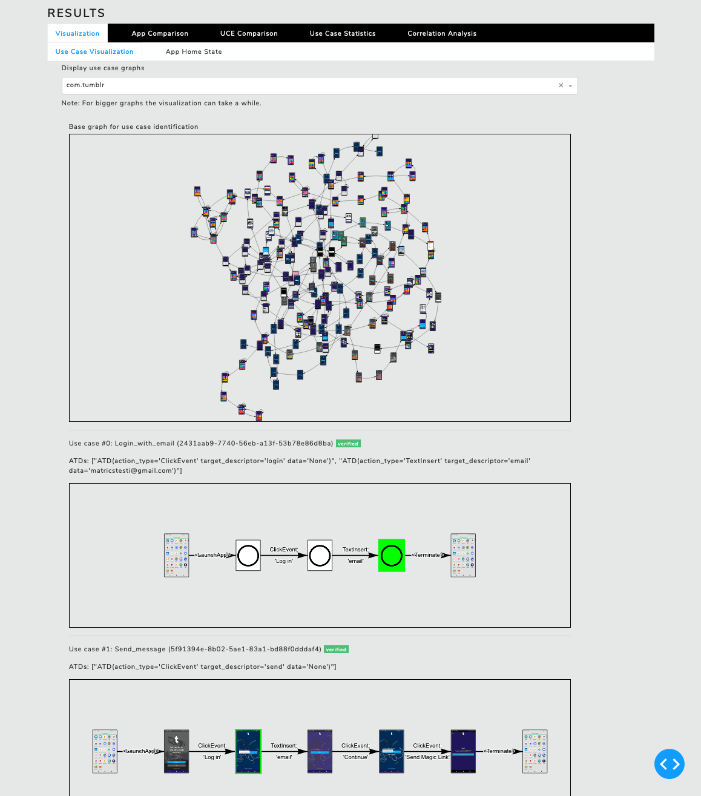
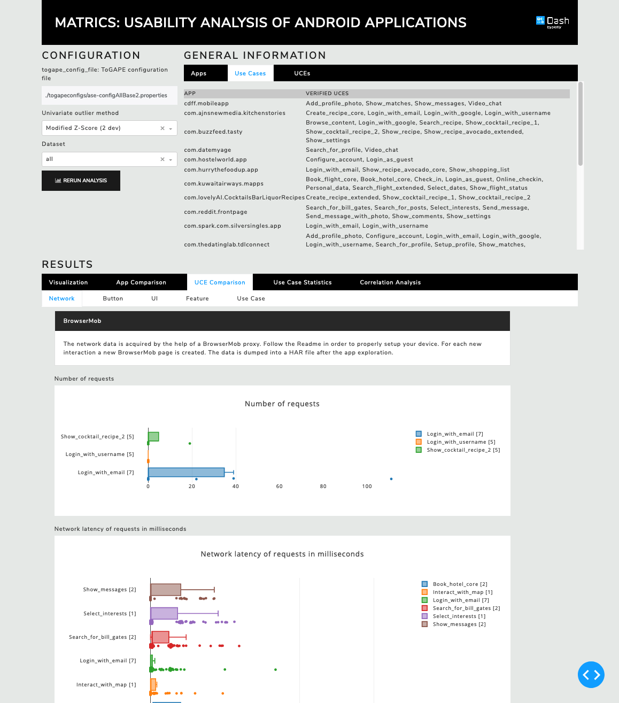

# Matrics

Matrics is a web app that I developed for my Master's thesis: `Automated Usability Analysis of Android Applications by Topic-Driven Exploration`.

The tool provides a multitude of features.
All analyses in this thesis are integrated in the developed prototype.
Matrics aims to aid the developer by visualizing exploration models and usability analyses and calculating UCE (Use Case Executions) based on the models.

## Thesis Abstract

Traditional usability testing involves user studies, assessments by experts, or sophisticated equipment, such as eye trackers.
These approaches are time-consuming, costly, and involve a high degree of human participation.

We developed an approach that analyzes a selection of usability properties of Android applications (apps) in an automated fashion on an app and use case level.
We combine existing test case generation methods, thesaurus aided exploration, and semantic matching technology to observe usability properties.
The app exploration is guided by comparing features on a semantic level, enabling us to analyze use cases, such as
"Select hotel, choose double bed room, select dates, and complete booking".
We employ image hashing to post-process the app models and solve the rural postman problem to identify the execution of use cases.
The novel use case aggregation level provides context sensitivity which enables more accurate and elaborate assessments as opposed to the global app level.

One of the key contributions to this thesis is the development of metrics to measure usability.
We apply statistical analysis, namely Tukey's fences, on the app and use case levels to determine standard behavior of our usability metrics.
As a consequence, we learn how the majority of apps implements certain usability properties.
At the same time, the statistical analysis detects outliers indicating potential usability flaws,
such as "App X has a significantly higher number of network requests for the login use case, compared to all other apps".

Our approach does not aim to replace user studies, but rather to make user studies more effective
and enable those who do not have sufficient resources to also be able to assess usability.
App developers benefit from our developed tool prototype by being able to compare their app with other apps in a convenient manner and by being able to assess usability without conducting elaborate user studies.
Similarly, market vendors like Google Play Store, benefit by being able to automatically prevent certain usability flaws, thus increasing the quality of their
offered apps.

## Technology Stack

The technology stack is composed of several powerful frameworks.
[Dash](https://plotly.com/dash/) is used as web application framework.
The Python framework provides a handy library and an out-of-the-box web server to run the web app.
Dash was developed to create analytic and data science dashboards.
[Plotly](https://plotly.com/graphing-libraries/) is an interactive graphing library and is used to create the graphs and charts.
Matrics leverages several frameworks for mathematical and statistical computations:
[pandas](https://pandas.pydata.org/), [NumPy](https://numpy.org/), and [SciPy](https://www.scipy.org/).
[OpenCV](https://opencv.org/) is a computer vision library and is used for most of the image related tasks,
like drawing widget borders and downsampling images to reduce memory load for visualizations.
[Networkx](https://networkx.github.io/) is a graph library and is used for most of the graph analyses and operations, such as shortest paths.
